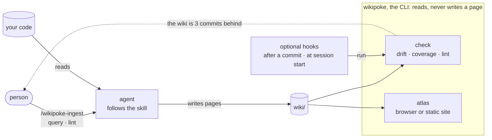
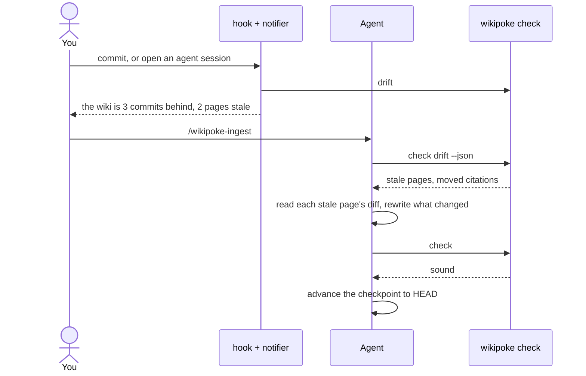
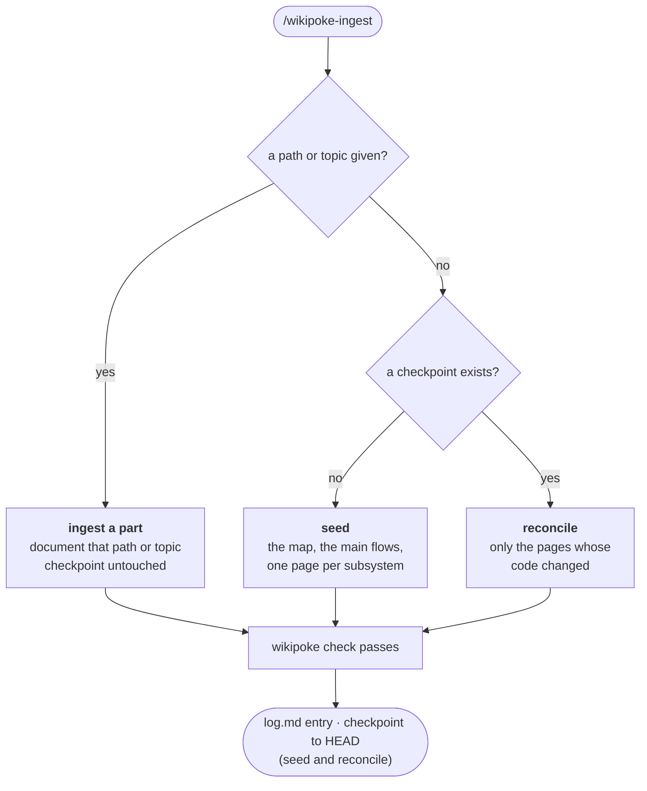
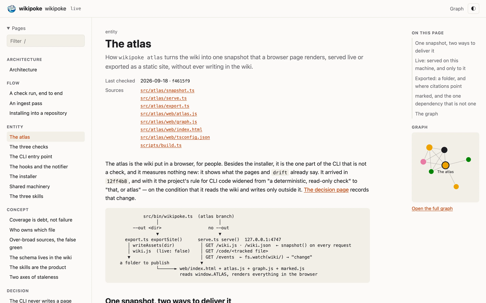
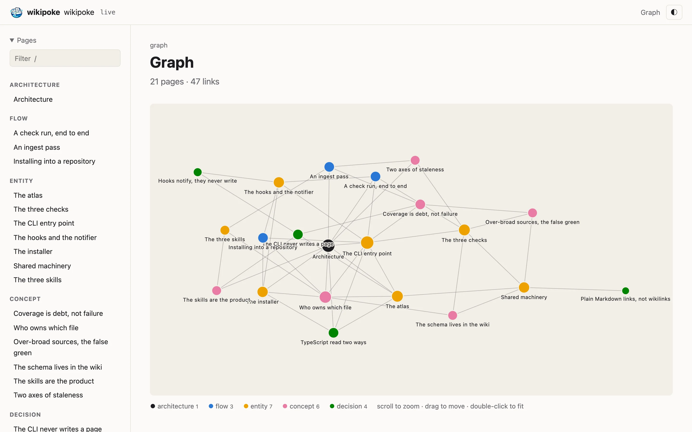

<p align="center"></p>

# Wikipoke

<p align="center"><b>A code wiki your agent writes, keeps true to the code,<br>
and grows from the questions you ask it.</b></p>

Wikipoke has your coding agent write a wiki of your repository: the map, the flows that cross
files, the decisions and why they were taken, with every claim pointing at a line of code. When the
code changes, it tells you which pages went stale and which citations moved, and the agent brings
them back in line. Ask how something works and the agent reads a page instead of exploring the
repository. When the page holds the answer, that is fewer tokens and the same answer every time;
when it does not, the agent pays for the wiki and the code, and offers to file what it found so the
next person does not ([measured on three repositories](#does-it-save-tokens)).

*A session in OpenCode, cut down to 47 seconds: the agent runs `wikipoke init` and adds its hook,
seeds the wiki with the `wikipoke-ingest` skill (six minutes: 20 pages, uncovered code files down
from 43 to 1), and answers a question about the code citing the lines and the pages that cover it.*

https://github.com/user-attachments/assets/05c7f03d-da40-41a2-8e53-c66d0dce32b7

*Thirty seconds in `wikipoke atlas`, on the wiki this repository keeps of itself: the page list, the graph, a page with its sources, the filter.*

https://github.com/user-attachments/assets/d72063c0-20ba-4632-83ca-31e9e391ba59

A code wiki that agents maintain. Three skills write it; one small CLI sets it up, checks it and
shows it, and never writes a page.



- **The skills govern.** A person launches `wikipoke-ingest`, `wikipoke-query` or `wikipoke-lint`;
  the agent follows the skill and writes Markdown pages directly under `wiki/`. The rules live in
  `wiki/CONVENTIONS.md`, which the project owns and edits.
- **The CLI only measures and shows.** `wikipoke check` is deterministic, reads git and the pages,
  and reports; `wikipoke atlas` puts the same pages in a browser. Neither has a publish step, a
  lock, a staging area or a plan to follow.
- **Coverage is debt, not failure.** Code no page covers is listed so the next pass knows where to
  go. A plain `check` fails only when the wiki is broken: a missing field, a dead source, a broken
  link.

## What it is for

A memory of your codebase that stays true, and answers what has been asked before cheaply and the
same way every time. Fewer tokens are a consequence of that, on the questions the wiki already
covers; they are not a promise for every question ([the numbers](#does-it-save-tokens)).

What it gives you that the code and a search do not:

- **What the code does not say.** Why something is built the way it is, the choice that was
  discarded, what a command leaves out, where two modules meet. A `grep` finds a name, not a reason.
- **Documentation that says when it is wrong.** Every claim cites a line, and `wikipoke check`
  lists the pages whose code moved and the citations that now point elsewhere. Hand-written docs,
  and docs an AI generated once, go out of date in silence.
- **Answers that stay answered.** The first time a question finds a gap it costs more than asking
  without a wiki: the agent reads the wiki, then the code. It then offers to file what it found, and
  from then on that question, and the same question put another way, is answered from the wiki.
- **The same answer at a predictable cost**, as long as the pages are well written. A vague page
  produces confident wrong answers just as reliably, which is why reading what gets filed is part
  of the work, not an extra.

When it pays off, and when it does not:

- **It pays off** in medium and large repositories where people and agents keep coming back to the
  same questions (triage, onboarding, support) and the answers cross modules. On a 1,480-file
  Laravel app, such questions cost 55% and 75% fewer tokens once the wiki had their answers.
- **It pays off least** in a small repository. Covered questions still come back cheaper (37% and
  49% fewer on two of them), but a search finds most things quickly there, and building the wiki
  took 70 to 100 questions to pay back.
- **It does not** for one-off questions, for questions that name something the code spells out (one
  `grep` finds it), or in a team that will not read what its agents file.

How to use it for that:

- **Seed small, then grow with the questions.** A seed draws the map and the main flows (about 5M
  tokens on that Laravel app), and each gap a question finds is filed once (0.2M to 0.8M).
  `/wikipoke-ingest all`, which gives every part of the code a pass, cost 39M there: it is for
  documentation you want to publish, not for saving tokens.
- **Judge it by the second question, not the first:** what it costs, and whether it is right, when
  someone asks again.

Still unmeasured: whether the wiki beats a well-kept `AGENTS.md` plus `grep`, and what it is worth
to people reading it rather than to agents.

## Features

What a repository gets once wikipoke is installed:

- 🧠 **Three skills, for any agent.** `wikipoke-ingest` seeds the wiki, reconciles it with what
  changed, or documents a part you point it at; `wikipoke-query` answers from the wiki before
  opening code; `wikipoke-lint` explains what is wrong and, with `--deep`, reads the pages for
  contradictions and gaps. Installed where Claude Code looks (`.claude/skills/`) and where other
  agents do (`.agents/skills/`).
- 🕰️ **A wiki that knows when it is out of date.** Every page names the files it documents and the
  commit it was checked against, so `wikipoke check drift` lists the stale pages and every
  `path:line` citation the code has moved, with the line it points at now.
- 📋 **Coverage as a backlog.** The code no page covers, grouped by folder, so the next pass knows
  where to go, and a count of what the ignore list hides.
- 🩺 **Lint for the wiki.** Missing fields, broken links, sources that no longer exist, citations that
  land on a blank line, pages nothing links to.
- 🗺️ **The atlas.** The wiki in a browser, redrawn live while an agent writes it, or exported as a
  static site; with a graph of how the pages link, the way Obsidian draws a vault.
- 🔔 **Optional hooks.** A notice after each commit or when an agent session starts, for
  git, Claude Code, OpenCode, Cursor and `AGENTS.md`. Silent when the wiki is current, and none of
  them ever writes it.
- 💸 **Fewer tokens on the questions it covers.** 37% to 49% fewer on two small repositories; on a
  large one, 21% to 75% fewer on five of six questions once their answers were filed, and 7% more
  on the sixth. The first time a question finds a gap it costs more than asking without a wiki
  ([details](#does-it-save-tokens)).
- 🪶 **Any language, no runtime dependencies.** Node 22.18 and git. The schema is a Markdown file the
  project owns and edits, page types included; `--json` and `--strict` fit it into CI.

## Use cases

Four ways to run it, start to finish. Commands starting with `/` go to your agent; the rest run in
a terminal.

### 1. The whole system, from scratch

The skills write the wiki, the hooks notice when it falls behind, and each pass brings it back.

1. `npm install -g wikipoke`, then `wikipoke init` in the repository.
2. At the hook prompt, name `git` for a notice after each commit, plus the one for your agent:
   `claude`, `opencode`, `cursor` or `agents`.
3. `/wikipoke-ingest` seeds the wiki: the architecture, the main flows, a page per subsystem.
4. Commit `wiki/`, the skills and the hook files, so everyone who clones gets them. Only the `git`
   hook has to be installed again in each clone, unless the repository uses husky 9: then it lives
   in `.husky/post-commit` and travels with the rest.
5. From then on, a commit or a new agent session says when the code has moved past the wiki, and
   `/wikipoke-ingest` rewrites only the pages whose code changed.

### 2. Questions that stay answered

`wikipoke-query` answers from the wiki, and what it has to dig out of the code can go back in.

1. Ask through the skill: `/wikipoke-query how are invoices rounded?`
2. The agent searches the wiki for the question's terms, reads the pages that match in the same
   step, and answers citing them. If the wiki does not cover it, it reads the code, answers with
   `path:line` citations, and says the wiki had a gap.
3. It offers to file the answer back, as a section on an existing page or as a new page. Say yes.
   That first answer cost more than asking without a wiki: the agent read the wiki, then the code.
4. It writes the page, links it from its neighbours, adds it to `index.md` and `log.md`, and runs
   `wikipoke check lint`. Read what it filed: a section that leaves out a case is worse than none.
   The next person, or the next agent, who asks finds it there, and pays less than asking without
   the wiki.

### 3. The skills without the notices

After the first pass, keep the wiki and the skills, and stop being told that the wiki is behind.

1. `wikipoke init` and `/wikipoke-ingest`, as above.
2. `wikipoke hooks` lists what is installed; `wikipoke hooks remove git claude` takes those out. The
   last one takes the notifier with it.
3. `/wikipoke-query`, `/wikipoke-ingest` and `/wikipoke-lint` keep working whenever you name them.
4. Nothing warns you now, so check when it matters, for instance when you close a feature:
   `wikipoke check drift`, then `/wikipoke-ingest` to catch up. `wikipoke hooks add <name>` brings
   a hook back.

### 4. Documentation to read and publish

The ingest writes the pages; the atlas puts them in a browser, or in a folder you can publish.

1. `wikipoke init`, then `/wikipoke-ingest` to seed the wiki.
2. `wikipoke check coverage` lists the code no page covers yet; `/wikipoke-ingest src/billing`
   documents one of those parts, and `/wikipoke-ingest all` gives every part a pass. That is the
   expensive way in — about 39M tokens on a 1,480-file app — and worth it when the site is the goal.
3. `wikipoke atlas` serves the wiki at http://127.0.0.1:4747. Left open during a pass, it redraws
   each page as the agent writes it.
4. `wikipoke atlas --out site` exports it as a static site, with citations pointing at your GitHub
   or GitLab remote. Publish the folder wherever you host static pages.

## Install

Node 22.18 or later and git. Wikipoke has no runtime dependencies: the CLI is TypeScript
compiled to plain ESM on install, and everything it needs at run time is in Node's standard
library. The one library atlas uses, [marked](https://marked.js.org), renders Markdown in the
browser; it is a devDependency the build copies next to the compiled code.

```sh
npm install -g wikipoke        # any repository, any language
npm install -D wikipoke        # or as a dependency of a JavaScript project
```

Before the first npm release, or to run a checkout, `github:delineas/wikipoke` works in either
command, and `npm run link` inside this repository compiles it and puts `wikipoke` on your `PATH`
(`npm run unlink` takes it off again).

> [!WARNING]
> Don't point a project at a checkout with `npm install -D ../wikipoke`: npm links the folder and
> runs its `prepare` there, which fails unless the checkout already has its own devDependencies,
> and the project's `package.json` ends up naming a path that exists only on your machine. Link it
> globally instead; the hooks find a global `wikipoke` as well as a local one.

Then, in the repository:

```sh
wikipoke init
```

In a terminal, `init` ends by asking which hooks to install; Enter installs none. Then, in your
agent, run the `wikipoke-ingest` skill to seed the wiki. It draws the avenues (architecture, the
main flows, one page per subsystem) and stops; later passes grow it one part at a time.

**Installing through an agent.** An agent can run `wikipoke init` for you. With nobody at the
terminal there is no one to answer the hook question, so `init` installs none and hands the
decision to the agent instead of dropping it: it prints what is missing, what each hook would do,
and the command. Which one fits is something the agent knows about itself and `init` cannot see —
so it asks you, and runs `wikipoke hooks add <name>`. Nothing installs a hook on its own.

## What `init` writes

| File | Owner | Purpose |
| --- | --- | --- |
| `wiki/CONVENTIONS.md`¹ | the project | the schema: page types, the template, the writing rules |
| `wiki/.wikipokeignore`¹ | the project | files that never count for coverage (tests, lockfiles, …); a `!` line brings some back |
| `.agents/skills/wikipoke-*/SKILL.md` | wikipoke | the three skills, for agents that read the neutral folder |
| `.claude/skills/wikipoke-*/SKILL.md` | wikipoke | the same skills, for Claude Code, which reads only this one |

¹ Or the directory `--dir` set, see below.

Both skill homes are always written. Claude Code reads only `.claude/skills` and runs perfectly
well against a checkout with no `.claude/` and no `CLAUDE.md` in it, so there is nothing in a
repository to detect it by; writing the skills for an agent that never comes costs three inert
Markdown files, and not writing them costs the agent every skill it has. A skill is inert either
way — nothing runs one until a person names it — which is the whole reason hooks are treated
differently below.

`init` never writes pages, `index.md`, `log.md` or `.wikipoke-state.json`: the first ingest pass
does.

**Somewhere other than `wiki/`.** `wikipoke init --dir docs/wiki` puts the wiki there and writes a
one-line `.wikipoke.json` so every later command agrees. The skills, the hooks and the schema are
written with the real path in them, so nothing has to look it up. To move an existing wiki, move
the folder, edit `.wikipoke.json` and run `init` again to refresh the skills.

## Hooks (optional)

A hook tells you or your agent, at the right moment, that the wiki has fallen behind. Every hook
runs the same notifier, `wiki/.wikipoke-hook.sh`, which prints what `drift` finds, stays silent
when the wiki is current, and never fails or calls a model. None of them writes the wiki. Coverage
stays out of it on purpose: that backlog is meant to outlive every pass, and a notifier that
repeats it at every commit and every session start is never silent, which is how a notifier gets
muted.



> [!IMPORTANT]
> **Install at least one.** Without a hook nothing ever tells you the wiki is stale —
> `wikipoke check` speaks only when someone runs it — and a wiki nobody is told about is one that
> quietly stops being true. `wikipoke hooks` says so whenever none is installed.

Only `git` has to be installed again in every clone, because `.git/hooks` is not versioned; the
other four are ordinary repository files, so committing one covers everyone who clones.

```sh
wikipoke hooks                        # the list: which are installed, which are outdated
wikipoke hooks add git claude         # install some, or update installed ones
wikipoke hooks remove claude          # take one out
```

| Hook | Writes | Speaks |
| --- | --- | --- |
| `git` | `.git/hooks/post-commit` | after each commit, in your terminal (per clone) |
| `claude` | a `SessionStart` entry in `.claude/settings.json`, plus the Claude Code skills | when a Claude Code session starts |
| `opencode` | `.opencode/plugin/wikipoke.js` | when an OpenCode session starts, once per session |
| `cursor` | `.cursor/rules/wikipoke.mdc` | a rule Cursor reads in every session |
| `agents` | a delimited block in `AGENTS.md`, created if missing | Codex and any agent that reads `AGENTS.md` |

The notifier is written with the first hook and removed with the last.

## Files wikipoke manages

Files owned by the project (`CONVENTIONS.md`, `.wikipokeignore`) are written once and never
overwritten; when `CONVENTIONS.md` differs from the template a newer wikipoke ships, `init` says so
and names the template, so the project can carry over what it wants. Files owned by wikipoke carry
a `managed by wikipoke` line. A file in their place that lacks that line is left alone, and the
command says what to add by hand. In shared files (`.claude/settings.json`, `AGENTS.md`) wikipoke
adds and removes only its own entry.

**After upgrading wikipoke**, run `wikipoke init`. It refreshes the skills, which are inert until
someone names one. It does not refresh the hooks, which act on their own: it lists the ones an
older version installed as `outdated`, with the command that updates them, and leaves them as they
are until someone runs it.

## The skills

| Skill | What it does |
| --- | --- |
| `wikipoke-ingest` | seeds the wiki; reconciles pages with what changed since the checkpoint; or, given a path or a topic, documents a part no pass has covered (`all`: every part, one pass each) |
| `wikipoke-query` | answers from the wiki first, falls back to the code, and offers to file the answer back |
| `wikipoke-lint` | explains what `check` found; with `--deep`, reads the pages for contradictions, expired claims, gaps, and the flows and decisions coverage cannot ask for |

> [!TIP]
> Ask questions through `/wikipoke-query <question>`. An agent does not always reach for the wiki
> on its own, and the saving below is only there when it does.

`wikipoke-ingest` decides what kind of pass to run from the arguments and the wiki's state, so the
same command seeds a new repository and keeps an old one current:



## Does it save tokens?

Sometimes. It saves tokens on questions a page already answers, and costs more on the ones it does
not. Three repositories, one model (glm-5.3-flash through OpenCode), a fresh session per question.
Tokens are everything the model processed (input, cached input and output) over the whole answer.

**Two small TypeScript repositories**, same code on two branches, one with a seeded wiki; three
questions a wiki page covers, three runs each:

| Repository | No wiki (median tokens per question) | With `/wikipoke-query` | Tokens | Cost |
| --- | --- | --- | --- | --- |
| a library: 32 source files, ~11k lines, a third of them comments | 308k | 157k | −49% | −40% |
| a CLI: 39 source files, ~7.5k lines, 7% comments | 384k | 242k | −37% | −48% |

**A Laravel application with 1,480 code files**, triage questions of the kind a team asks about a
bug or a feature, each asked without the wiki (the folder moved out), with a wiki whose page only
pointed at the code, and again once the answer had been filed. Medians of 1 to 5 runs:

| Question | No wiki | Wiki, page points at the code | Wiki, answer filed |
| --- | --- | --- | --- |
| a team member cannot see premium content | 425k | 133k | 105k (−75%) |
| a subscriber never got the welcome email | 232k | 200k | 105k (−55%) |
| can we give a user more AI tokens? | 200k | 254k | 100k (−50%) |
| do we have a GDPR data export? | 102k | 186k | 75k (−26%) |
| the welcome link stopped working | 126k | 263k | 100k (−21%) |
| a private podcast feed stopped updating | 101k | 203k | 108k (+7%) |

The saving comes from steps, not from shorter reads. Every step re-sends the whole conversation —
some 20k to 30k tokens of system prompt and tool definitions before anything is read — so an answer
costs roughly its number of steps. Without the wiki the agent searches and opens files until it has
the picture. With it, it reads the pages and opens code only for what they lack: when a page holds
the answer that is three or four steps, and when it only points at the code the agent pays for the
wiki and then for the code, up to twice what the question cost without it. That first answer is
the moment `wikipoke-query` offers to file what it found, and once filed the same question, and the
same question put another way, came back from the wiki alone.

Where the wiki helps least: a question that names something the code spells out ("GDPR" is in the
export command's description) is found by one `grep`, so a wiki can only just beat it, and did so
only once the skill searched and read the pages in a single call. Where it helps most is the
question that crosses modules with no word to search for, where the agent without it sometimes
spawned subagents and spent 400k to 500k.

The same runs showed more than tokens:

- **Name the skill when you want the saving.** Left to decide, the agent opened the wiki in 17 of
  18 runs with the current skill description and saved about as much (−50% and −38% median), but
  in only 3 of 9 on the library with an earlier description that fired on "how does X work", and
  every skipped wiki is paid in exploration. `/wikipoke-query` removes the guess.
- **A page is only as good as its sentences.** One page explained two cases in the same paragraph.
  Four of six answers that read it merged them, while every answer that read the code kept them
  apart; rewritten with one sentence per case, six of six were right. On the Laravel app a page
  that left out which way an adjustment's sign works led two answers in three to state it backwards
  with confidence; once filed, three of three were right. `CONVENTIONS.md` carries the rule.
- **Read what gets filed.** Two of the first four filings left out part of what had been asked,
  and one kept a false sentence from before. The skill now re-reads a filed section against the question, and the next two were complete.
- **The wiki costs tokens to build, and pays back only through questions.** Covering the library's
  whole backlog took about 14M tokens, paid back after roughly 70 to 100 questions. On the Laravel
  app a seed took about 5M, covering everything took 39M (and claimed folders nobody had read until
  the skill forbade it), and filing one gap 0.2M to 0.8M. A seed plus the gaps your questions find is
  the cheap way in; `all` makes sense for documentation you want to publish, not for saving tokens.

> [!NOTE]
> One model, 1 to 5 runs per cell and a wide spread (one no-wiki answer on the CLI took 1.6M
> tokens), and 4 of 24 Laravel runs where the model returned no answer at all. This measures these
> repositories, not yours.

## `wikipoke check`

```sh
wikipoke check              # all three
wikipoke check drift        # commits not indexed, stale pages, and citations the code moved
wikipoke check coverage     # tracked files no page's `sources:` claims
wikipoke check lint         # fields, types, links, citations, dead and over-broad sources, orphans
```

`--json` for the skills, `--strict` to exit 1 on any finding (CI), `-v` to list every file.
A plain run exits 1 only on lint errors.

## `wikipoke atlas`

```sh
wikipoke atlas              # the wiki at http://127.0.0.1:4747, redrawn as pages change
wikipoke atlas --port 8080
wikipoke atlas --out site   # the same page as a static site: open index.html, or publish the folder
```

A reader for people. Pages are grouped by the `type:` values in `CONVENTIONS.md`, and each one
opens with its `responsibility`, the date and commit it was last checked against (`synced:`) and
its sources. It ends with the pages it relates to and the ones that link to it, and with a plain
note for each caveat it carries: that part of it is reconstructed (`confidence: inferred`), or
that files changed after it was checked (what drift calls stale), naming them. Headings
make a table of contents beside the page, and `/` filters the page list.



The graph draws the pages as nodes and their links as edges, the way Obsidian does: a view of its
own, where you zoom, pan and drag, and a small one beside each page with that page's neighbours.
Nodes are coloured by type, sized by how many links they have, and ringed when out of date;
hovering one lights up what it touches, and clicking it opens the page.



Live, a citation opens the cited file at its line, served only if git tracks it, and the page
redraws when a file in `wiki/` changes, so an ingest pass can be watched as it lands. It stops at
the wiki: an edit to the code shows up as a stale page on the next redraw, not on its own.
Exported, citations point at the remote (GitHub or GitLab) at each page's `synced:` commit, which
is the code the page was last checked against, and the snapshot is taken at the moment you export.
`--out` writes only into a new or empty directory, or one a previous export made, and never
inside the wiki.

## A page

```markdown
---
title: Billing
type: entity
responsibility: How invoices are computed, rounded and taxed.
sources:
  - src/billing/
synced: a1b2c3d
---

Invoices round per line, not per total, because… See [the checkout flow](../flows/checkout.md).
```

`sources:` ties the page to the code and `synced:` to the commit it was checked against; together
they are how `drift` knows the page is stale. Links are plain Markdown, so `check` can verify every
one, and so are the citations in the body — `path:line`, or a link with a GitHub line anchor
(`#L42`). `drift` carries each citation through the diff from the commit that wrote it and says
which line it points at now — on a stale page, and on one re-stamped without its pointers being
moved — and `lint` re-reads each one and reports those that fall past the end of their file, on a
blank line or on a lone closing bracket. The full contract is in
the `CONVENTIONS.md` that `init` writes, and the valid `type:` values are the rows of its page-type
table.

## Uninstall

```sh
wikipoke uninstall
```

Removes the skills and every hook, including wikipoke's entries in shared files. `wiki/` stays: it
is the project's knowledge.

## Where this comes from

The design is the wiki inside the widgetron repository, made repository-agnostic: the same three
verbs (after Andrej Karpathy's LLM-maintained wiki pattern), the same checks and the same page
contract. Version 0.1 on the `main` history took a different road, with the CLI as the writer
(planned batches, staged publication, a writer lock, a completeness seal). Agents ended up driving
the CLI instead of following the skills, and every real run surfaced new rules to add. This
version keeps the writing in the skills and the CLI read-only.

## Development

The CLI is TypeScript under `src/`, and it is read two different ways.

```sh
npm test         # node --test test/*.test.ts — runs the sources, no build first
npm run typecheck
npm run build    # tsc -> dist/, the ESM that actually ships, plus atlas's page and marked
npm run link     # build, then `npm link`: the working copy becomes your global wikipoke
npm run unlink   # take it off the PATH again
```

Node runs a `.ts` file by stripping the types out of it, so during development there is nothing
to build and the tests exercise the same file you just edited. It refuses to do that for anything
under `node_modules/`, though, which is exactly where an installed wikipoke lives — so what ships
is compiled: `prepare` runs `tsc` on install, and `bin` points at `dist/bin/wikipoke.js`.

Two consequences for anyone editing `src/`: imports name the `.ts` file (`./lib.ts`; `tsc`
rewrites the specifier to `.js` when it emits), and only syntax that erases to nothing is allowed —
no `enum`, no `namespace`, no parameter properties. `erasableSyntaxOnly` in `tsconfig.json` fails
the check rather than letting one through.

atlas's page, in `src/atlas/web/`, is the exception: plain HTML, CSS and JavaScript the browser
runs as they are, which `scripts/build.ts` copies into `dist/` along with marked. `atlas.js` is
still type-checked, through its own `tsconfig.json`, against the snapshot's types.
